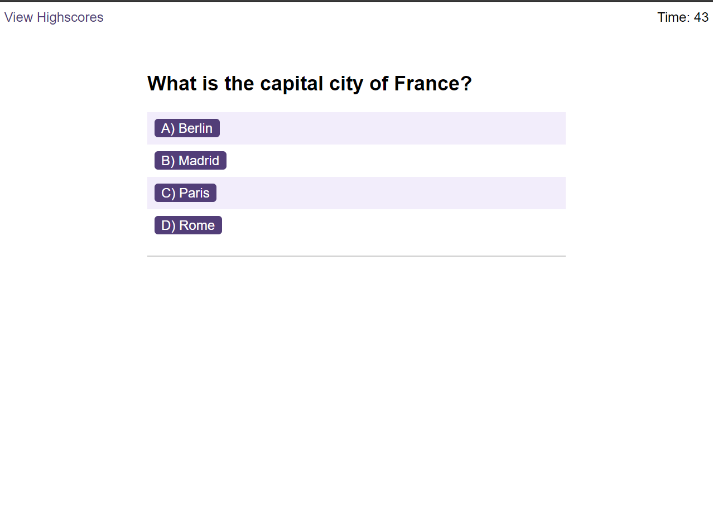

# Quiz Game

Welcome to the Quiz Game project! This engaging web application provides a fun and interactive way to test your knowledge on various topics through timed quizzes.

## Features

- **Dynamic Quiz Questions**: Users are presented with a series of questions, each with multiple-choice answers.
- **Timed Challenges**: Each quiz is timed, adding an extra layer of challenge and excitement.
- **Immediate Feedback**: Users receive instant feedback on their answers, knowing immediately if they've answered correctly or incorrectly.
- **Score Tracking**: Scores are tracked throughout the quiz, providing users with a final tally at the end of the game.
- **Penalty for Incorrect Answers**: Incorrect answers result in a time penalty, increasing the challenge.
- **Local High Scores**: Users can save their scores locally to compete against themselves or friends.

## How to Use

1. Open the application in your web browser.
2. Click the "Start Quiz" button to begin.
3. Answer the questions as they appear on the screen.
4. Keep an eye on the timer! Incorrect answers will penalize your remaining time.
5. Once you complete the quiz, your score is displayed. Enter your initials to save your score to the high score list.
6. View the high score list to see where you rank.

## Technologies Used

- **HTML**: Structures the content on the web page.
- **CSS**: Styles the layout and look of the quiz.
- **JavaScript**: Powers the game logic, event handling, and local storage for high scores.

## Links

Live URL: https://jsneath.github.io/code-quiz/
Repository: https://github.com/jsneath/code-quiz

